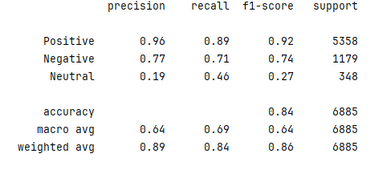

# 1. Amazon Product Review Analysis 

The project aims to analyze customer sentiment expressed within the Amazon Product Reviews Dataset (2023 release). 
The primary input for the classification task is the user-provided review text. Sentiments are identified by converting the original 
1.0 to 5.0 numerical ratings into a three-class categories: Positive, Negative, Neutral. 

### Dataset
The full dataset includes both review text and rich product metadata, such as product title, category, and description, spanning 
the years 2003 to 2023. For enhanced computational efficiency and to narrow the analytical focus, the dataset was strategically filtered:  

**1. Temporal Scope:** Data was limited to the most recent decade of reviews, covering the period from 2013 to 2023.   

**2. Categorical Scope:** The analysis was restriced to a targeted selection of six product categories: 'All Electronics',
'Automotive', 'Baby', 'Camera & Photo', 'Health & Personal Care', 'Sports & Outdoors', 'Office Products'. 

Here is the link to the original dataset: [link to the dataset](https://amazon-reviews-2023.github.io/)

### Model 

As a classification model, 'DistilBERT' has been used. The model is a pretrained model based on 'BERT' model.   
It's a smaller model but with faster computing. 'DistilBERT' is 40% smaller than BERT, which means that it's more efficient and faster.  

Here is the link to DistilBERT model in Hugging Face: [link to the model](https://huggingface.co/docs/transformers/en/model_doc/distilbert)

### Results 

**1. High Accuracy**    
The training process returned a high accuracy 84%. However, the result is misleading because it is dominated by the positive class. the vast majority of the test data comes from positive target. 

**2. 'Neutral' class**  
Unlike 'Positive' and 'Negative' classes that returned acceptable f1 score '92%' and '74%' respectively, 'Neutral' class returned low f1 score '27%'. The 'Neutral' class has the lowest support (test sample, only 348), leading the poor performance. We used class weighting during training. Although the class weight was 6.33 (highest weights) for Neutral class, 348 samples is a very small number for a model to learn the lingustic nuances, compared to 5358 positive samples.

# 2. Recommendation system for products 

I applied recommendation sytstem - content based filtering to the dataset, to create a recommendation system for products from  Appliances Categories. The system works 
in three main stages:  
* Search Filtering (product name): it identifies products that match the user's input (e.g., washer) within the main product name column
* Category Similarity (sub_categories): it uses the pre-computed CountVectorizer results to find products that are semantically related in their sub-categories. For similarity, cosine_similarity was applied. 
* Quality Filtering (ratings) : It filters or sorts the similar products based on a minimum acceptable average rating.

## Testing the function 
* To validate that the recommend_product function is working as intended, we will execute it with a sample user query. 
* The function should identify a seed product containing 'washer' in its name, calculate the similarity scores based on its sub-categories, filter by the minimum rating, 
  and return the top recommended products, ranked by similarity.
* Upon running the function with the query 'washer', the system successfully returned the top 5 most relevant products. 

